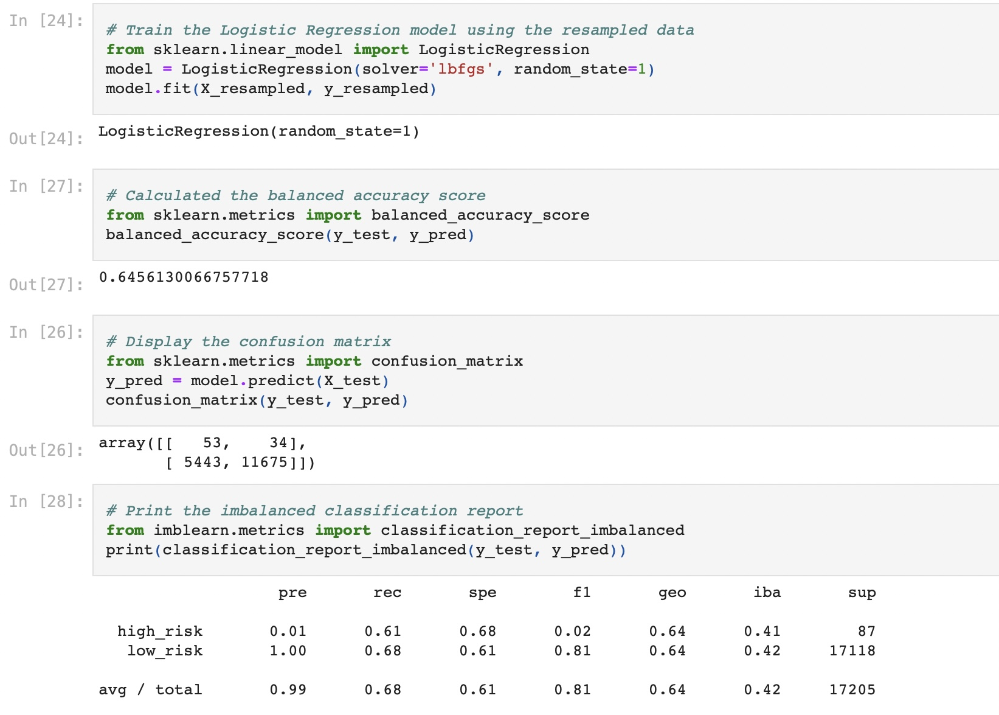
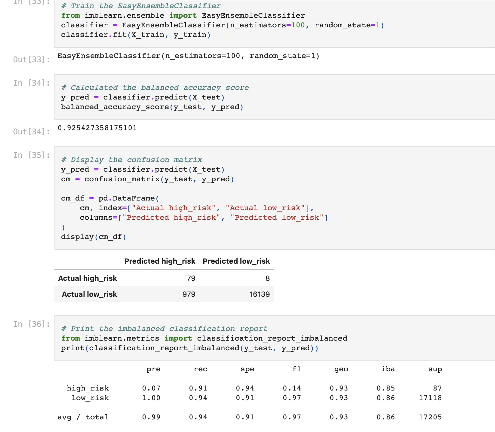

# Credit_Risk_Analysis

### Overview of the loan prediction risk analysis:
Credit risk is an inherently unbalanced classification problem, as good loans easily outnumber risky loans. Therefore, different techniques were employed to train and evaluate models with unbalanced classes. imbalanced-learn and scikit-learn libraries were used to build and evaluate models using resampling. 

Using the credit card credit dataset from LendingClub, a peer-to-peer lending services company, the first step was to oversample the data using the RandomOverSampler and SMOTE algorithms, and undersample the data using the ClusterCentroids algorithm. Then, used a combinatorial approach of over- and undersampling using the SMOTEENN algorithm. Next, compared two new machine learning models that reduce bias, BalancedRandomForestClassifier and EasyEnsembleClassifier, to predict credit risk. evaluate the performance of these models and determine whether they should be used to predict credit risk.

### Results
There is a bulleted list that describes the balanced accuracy score and the precision and recall scores of all six machine learning models

##### RandomOverSampler

##### SMOTE

##### ClusterCentroids

##### SMOTEENN

##### BalancedRandomForestClassifier

##### EasyEnsembleClassifier

##### Summary
TheEasy Ensemble AdaBoost Classifier were best at predicting high risk credit applications in comparison to the other models. With a 0.925 accuracy and a 0.91 recall score, both Easy Ensemble AdaBoost and Random Forest Classifiers outperformed the Resampling techniques in accurately predicting high-risk credit card applicants.

